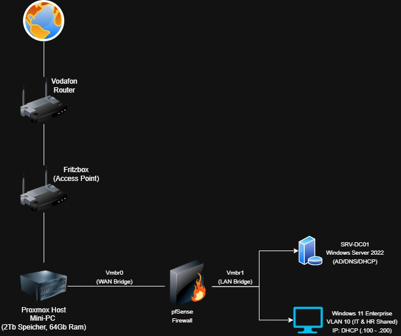

# Enterprise IT Infrastructure Simulation (Active Directory & Network Security)

Dieses Projekt dokumentiert den Aufbau eines vollständigen Enterprise-Homelabs unter Verwendung von Proxmox, pfSense und Windows Server 2022. Alle Schritte wurden nach der STAR-Methode (Situation, Task, Action, Result) dokumentiert.

## 🌐 Network Topology

---

Phase 1: Windows Server 2022 Deployment & VirtIO Optimization
Situation:
Nach der erfolgreichen Implementierung der pfSense-Firewall als Edge-Router im Enterprise-Homelab wurde ein zentraler Identity Provider (Domain Controller) benötigt. Die Herausforderung bestand darin, Windows Server 2022 auf dem Proxmox-Host so bereitzustellen, dass die Hardware-Ressourcen des Mini-PCs maximal geschont werden und I/O-Engpässe durch Emulation vermieden werden.

Task:
Erstellung und Konfiguration einer Windows Server 2022 Virtual Machine. Zur Gewährleistung maximaler Performance durften keine Standard-IDE/E1000-Treiber verwendet werden. Stattdessen musste die gesamte I/O-Kommunikation (Disk, Network, Memory Ballooning) über paravirtualisierte VirtIO-Treiber realisiert werden. Zudem mussten die Microsoft-Sicherheitsstandards (UEFI & TPM 2.0) nativ in Proxmox abgebildet werden.

Action:

VM-Provisionierung: Erstellung der VM (SRV-DC01) mit spezifischen Hardware-Parametern: 2 vCores (Typ: host für maximale CPU-Befehlssatz-Durchreichung), 4096 MB RAM.

Security & BIOS: Konfiguration von OVMF (UEFI) und Aktivierung eines virtuellen TPM 2.0-Moduls, gespeichert auf dem local-lvm Storage.

Storage-Optimierung: Zuweisung einer 50 GB Disk über den VirtIO SCSI single Controller. Aktivierung der Discard-Funktion zur Unterstützung von SSD-TRIM, um Speicherplatzverschwendung (Thin Provisioning) vorzubeugen.

Netzwerksegmentierung: Anbindung des VirtIO (paravirtualized) Netzwerkadapters ausschließlich an die isolierte Bridge vmbr1 (LAN hinter der pfSense).

Treiber-Injektion (Installation): Einhängen der Fedora VirtIO-ISO (v0.1.285) als sekundäres CD-ROM. Während des Windows-Setups wurde der Speichertreiber manuell aus dem Pfad vioscsi\2k22\amd64 geladen, um die SCSI-Festplatte für die Installation sichtbar zu machen.

Post-Install-Konfiguration: Ausführung der virtio-win-guest-tools.exe im installierten Windows Server (Desktop Experience), um die vollständige Suite an QEMU Guest Agents, Netzwerk- und Memory-Balloon-Treibern nahtlos in das System zu integrieren.

Result:
Der Windows Server 2022 ist nun vollständig betriebsbereit und kommuniziert über hochperformante Schnittstellen direkt mit dem Proxmox-Kernel. Das System ist sicher im isolierten vmbr1-Netzwerk integriert, hat erfolgreich eine IP-Adresse via DHCP von der pfSense bezogen und verfügt über volle Internet-Konnektivität für anstehende Updates. Die Basis für die Active Directory Domain Services (AD DS) ist somit geschaffen.

-------------------------------

Phase 2: Identity & Access Management (Active Directory Domain Services)
Zielsetzung:
Transformation des eigenständigen Windows Servers in den primären Domain Controller (PDC) zur Etablierung einer zentralen Authentifizierungs- und Verwaltungsinstanz für das gesamte Enterprise-Homelab.

Konfiguration & Umsetzung:

Netzwerk-Präparierung: Vergabe einer statischen IPv4-Adresse (192.168.1.10) innerhalb des isolierten vmbr1-Netzwerkes. Konfiguration des primären DNS-Servers auf die Loopback-Adresse (127.0.0.1), da der Server die Namensauflösung im internen Netzwerk übernimmt.

Systemidentität: Umbenennung des Systems auf den standardisierten Hostnamen SRV-DC01 gemäß Enterprise-Namenskonventionen.

Rolleninstallation: Implementierung der Rolle Active Directory-Domänendienste (AD DS) inklusive der zugehörigen Management- und PowerShell-Tools.

Domain-Promotion: Heraufstufen des Servers zu einem Domain Controller und Initialisierung einer neuen Gesamtstruktur (Forest) mit dem internen Root-Domain-Namen universe.local.

Architektur-Level: Festlegung der Gesamtstruktur- und Domänenfunktionsebene auf Windows Server 2016 (aktuellster Standard für On-Premise AD-Datenbanken). Automatische Integration des DNS-Servers und des Global Catalogs (GC).

Ergebnis:
Das Active Directory ist voll funktionsfähig. Der Server SRV-DC01 operiert nun als zentraler Identity Provider (IdP) und DNS-Server. Die kryptografische Basis für Kerberos-Authentifizierung, Gruppenrichtlinien (GPOs) und die Anbindung zukünftiger Linux/Windows-Clients ist erfolgreich implementiert.

-------------------------------

Phase 3: Organizational Structure & Role-Based Access Control (RBAC)
Aufgabe:
Aufbau einer logischen Verzeichnisstruktur (OU) und Anlage des ersten administrativen IT-Personals zur Vorbereitung auf den produktiven Betrieb und die spätere GPO-Verteilung.

Umsetzung:

OU-Architektur: Anlage der zentralen Organisationseinheit (OU) IT-Department unterhalb der Root-Domain (universe.local). Dabei wurde der Schutz vor versehentlichem Löschen (Accidental Deletion Protection) standardmäßig aktiviert gelassen.

User Provisioning: Erstellung des personalisierten administrativen Accounts innerhalb der neuen OU gemäß Enterprise-Namenskonventionen.

Privilege Escalation (RBAC): Zuweisung des neuen Accounts zur globalen Sicherheitsgruppe Domänen-Admins.

Security Best Practice: Dieser Schritt ermöglicht die delegierte Administration der gesamten Forest-Struktur und ersetzt die Nutzung des unsicheren, integrierten "Administrator"-Accounts für alltägliche Verwaltungsaufgaben.

-------------------------------

Phase 4: Group Policy Management & Network File Sharing (GPO)
Zielsetzung:
Automatisierte Bereitstellung eines abteilungsbezogenen Netzlaufwerks (Mapped Drive) für alle Mitarbeiter der IT-Abteilung zur zentralen Datenhaltung, implementiert durch Group Policy Objects (GPO).

Konfiguration & Umsetzung:

File Server Provisioning: Erstellung und Freigabe des Verzeichnisses IT-Share auf dem Domain Controller. Die Berechtigungen (Share Permissions) wurden initial auf "Vollzugriff" für Authenticated Users konfiguriert, wobei die restriktive Zugriffssteuerung später über NTFS-Berechtigungen (Security Tab) erzwungen wird (Microsoft Best Practice).

GPO-Erstellung: Anlage eines neuen Gruppenrichtlinienobjekts (GPO_MapDrive_IT) und direkte Verknüpfung (Linking) an die Organisationseinheit (OU) IT-Department.

GPO-Konfiguration (Preferences): Nutzung der Group Policy Preferences (GPP) unter Benutzerkonfiguration -> Einstellungen -> Windows-Einstellungen -> Laufwerkzuordnungen.

Drive Mapping: Konfiguration der Aktion auf Aktualisieren (Update) für den UNC-Pfad \\SRV-DC01\IT-Share mit Zuweisung des Laufwerksbuchstabens Z:.

Ergebnis:
Jedes IT-Personal (z.B. der neu angelegte Admin-User), das sich innerhalb der Domäne anmeldet, erhält ab sofort automatisiert und ohne manuellen Eingriff das Netzlaufwerk Z: gemappt. Dies beweist die Fähigkeit zur zentralen Automatisierung von Client-Konfigurationen.

-------------------------------

Phase 5: Client Integration & Role-Based Access Control (RBAC)
Zielsetzung:
Integration eines Windows 11 Enterprise-Clients in die Domäne und Implementierung einer rollenbasierten Zugriffssteuerung (RBAC) zur Absicherung von Abteilungsdaten durch granulare NTFS-Berechtigungen.

Konfiguration & Umsetzung:

Enterprise Client Provisioning: Konfiguration einer Windows 11 VM unter Proxmox mit VirtIO-Treibern (SCSI-Controller, VirtIO-Netzwerkkarte) zur Maximierung der I/O-Performance im Datacenter-Umfeld.

OOBE-Bypass & Domain Join: Umgehung des Microsoft-Online-Kontozwangs (OOBE-Bypass via CMD: OOBE\BYPASSNRO) zur Erstellung eines lokalen Kontos für Enterprise-Umgebungen. Anschließende Installation der VirtIO Guest Tools, Konfiguration der statischen IP/DNS-Einstellungen (verweisend auf den DC) und Aufnahme des Clients in die Domäne universe.local.

Active Directory Struktur (OU): Erweiterung der AD-Struktur durch Anlage abteilungsspezifischer Organisationseinheiten (z.B. HR-Department, IT-Department) sowie Anlage spezifischer Benutzerkonten mit unterschiedlichen Berechtigungsstufen (Lead-IT vs. Standard-IT).

NTFS-Berechtigungen (Hardening): Deaktivierung der Rechtevererbung (Inheritance) auf dem Verzeichnis IT-Share. Konvertierung der vererbten Berechtigungen und granulare Rechtevergabe: Modifikationsrechte (Ändern/Schreiben) für den IT-Lead und strikte "Read-Only" (Lesen/Ausführen)-Rechte für Standard-IT-Mitarbeiter. Entfernung der globalen Gruppe Benutzer (Users), um die Daten vollständig vor anderen Abteilungen (z.B. HR) zu isolieren.

Ergebnis:
Der Windows 11 Client ist erfolgreich in die Domäne integriert. Die automatisierte Laufwerkszuordnung (Laufwerk Z:) via GPO funktioniert nahtlos. Ein durchgeführter Zugriffstest (Access Test) mit dem Standard-Benutzerkonto bestätigte die absolute Wirksamkeit der NTFS-Sicherheitseinstellungen durch eine korrekte "Zugriff verweigert" (Access Denied) Meldung bei unautorisierten Schreibversuchen.

-------------------------------

Phase 6: Active Directory Redesign & Delegation of Control (RBAC)
Zielsetzung:
Restrukturierung des Active Directory Designs gemäß Enterprise-Best-Practices (Tier-Modell-Ansatz) sowie Implementierung einer Delegierung von Verwaltungsaufgaben (Delegation of Control), um das Prinzip der geringsten Rechte (Principle of Least Privilege) durchzusetzen.

Konfiguration & Umsetzung:

OU-Restrukturierung: Migration der flachen AD-Struktur in eine hierarchische und skalierbare Organisationseinheiten-Struktur (OU). Aufbau des Root-Verzeichnisses Company mit logischer Trennung nach Ressourcen-Typen (Users, Computers, Servers, Service Accounts) sowie abteilungsspezifischen Sub-OUs (IT, HR, Finance).

Objekt-Migration: Saubere Migration bestehender Computer- und Benutzerobjekte in die neuen, richtlinienspezifischen OUs ohne Unterbrechung der bestehenden Vertrauensstellungen (Trusts).

Delegation of Control (DoC): Anlage eines dedizierten HR-Manager-Kontos. Nutzung des Delegation of Control Wizards zur gezielten Rechtevergabe auf OU-Ebene.

Berechtigungszuweisung: Dem HR-Manager wurden exklusiv für die HR-OU die Rechte "Erstellen, Löschen und Verwalten von Benutzerkonten" sowie "Zurücksetzen von Benutzerkennwörtern" zugewiesen. Der Zugriff auf andere OUs (z.B. IT oder Finance) bleibt strikt verweigert.

Ergebnis:
Das Active Directory verfügt nun über eine saubere, GPO-ready Struktur, die mit dem Unternehmenswachstum skalieren kann. Der IT-Helpdesk wird durch die erfolgreiche Delegierung von Standardaufgaben (z.B. Passwort-Resets) an das HR-Management entlastet, ohne die globale Domänensicherheit zu gefährden.

-------------------------------

Phase 7: DNS Infrastructure & Name Resolution Management
Zielsetzung:
Aufbau und Konfiguration einer hochverfügbaren und fehlertoleranten DNS-Infrastruktur innerhalb der Active Directory-Umgebung zur Gewährleistung einer zuverlässigen Namensauflösung (Forward & Reverse) für alle Netzwerkteilnehmer und internen Dienste.

Konfiguration & Umsetzung:

Reverse Lookup Zone: Erstellung einer Active Directory-integrierten IPv4 Reverse Lookup Zone. Die Replikation wurde auf Domänenebene (Domain-wide) konfiguriert. Um maximale Sicherheit zu gewährleisten, wurden ausschließlich "sichere dynamische Updates" (Secure Dynamic Updates) zugelassen.

Resource Records (Forward Zone):

Anlage eines statischen A-Records (intranet.universe.local) zur Adressierung eines internen Web-Services inklusive automatischer Generierung des korrespondierenden PTR-Records.

Erstellung eines CNAME-Records (Alias) für www.universe.local, der als kanonischer Name auf den primären Domain Controller (SRV-DC01.universe.local) verweist.

Verifizierung & Troubleshooting: Die Funktionalität der Namensauflösung wurde mittels Kommandozeilen-Tools validiert. Ein ICMP-Echo-Request (ping) bestätigte die korrekte Forward-Auflösung der A- und CNAME-Records. Die korrekte Funktion der Reverse Zone wurde durch eine erfolgreiche Abfrage via nslookup auf die IP-Adresse des Servers verifiziert.

Ergebnis:
Das DNS-System ist vollständig funktionsfähig und AD-integriert. Clients können Dienste nun über benutzerfreundliche FQDNs erreichen, und das Netzwerk ist durch die funktionierende Reverse-Auflösung vor bestimmten Spam- und Spoofing-Angriffen besser geschützt.

-------------------------------

Phase 8: Automated Network Provisioning & Troubleshooting (DHCP)
Zielsetzung:
Automatisierung der IP-Adressvergabe innerhalb der Active Directory-Umgebung zur Vermeidung fehleranfälliger statischer Konfigurationen und zur Gewährleistung einer zentralisierten Netzwerkverwaltung für alle Client-Systeme.

Konfiguration & Umsetzung:

Rolleninstallation & Autorisierung: Installation der DHCP-Server-Rolle auf dem Domain Controller (SRV-DC01). Anschließende Autorisierung des DHCP-Servers im Active Directory gemäß den Sicherheitsrichtlinien der Domäne.

Scope-Konfiguration (IPv4): Erstellung eines neuen DHCP-Bereichs (Scope) mit einer definierten IP-Range (z.B. .100 bis .200) und einer Standard-Leasedauer von 8 Tagen für reguläre Unternehmens-Clients.

DHCP-Optionen: Konfiguration essenzieller Netzwerkparameter zur Verteilung an die Clients:

Option 006 (DNS-Server): Verweis auf den internen Domain Controller für die Namensauflösung.

Option 015 (DNS-Domänenname): Zuweisung des FQDN (universe.local).

Option 003 (Router/Standardgateway): Definition der Firewall/Router-IP für das externe Routing.

Troubleshooting (Gateway-Missing): Während der initialen Testphase zeigte der Windows 11 Client keine Internetverbindung (ICMP Request an 8.8.8.8 schlug mit "Allgemeiner Fehler" fehl). Eine detaillierte Analyse via ipconfig /all ergab, dass das Standardgateway nicht bezogen wurde. Die Ursache (ein nicht übernommener Wert in der Option 003) wurde im DHCP-Server umgehend korrigiert. Durch das Erzwingen eines neuen DORA-Prozesses (ipconfig /release & /renew) wurde die Konfiguration erfolgreich aktualisiert.

Ergebnis:
Das DHCP-System ist vollständig operativ. Alle Domänen-Clients beziehen nun dynamisch und fehlerfrei ihre IP-Konfiguration inklusive korrektem Gateway und DNS. Die vollständige Konnektivität (LAN & WAN) ist hergestellt und validiert.

-------------------------------

Phase 9: Group Policy Security (GPO) & Advanced Network Troubleshooting
Zielsetzung:
Erzwingung abteilungsspezifischer Sicherheitsrichtlinien (z.B. Sperrung der Systemsteuerung für die HR-Abteilung) mittels Group Policy Objects (GPO) sowie Sicherstellung einer fehlerfreien Richtlinienverteilung durch die Behebung komplexer Netzwerk- und DNS-Anomalien.

1. GPO Konfiguration & Implementierung:

Policy Design: Erstellung eines neuen Gruppenrichtlinienobjekts (GPO_HR_Security) und direkte Verknüpfung (Linking) mit der Organisationseinheit OU=HR.

Administrative Vorlagen (ADMX): Konfiguration der Benutzerrichtlinie zur Härtung des Client-Betriebssystems durch Aktivierung der Option "Zugriff auf Systemsteuerung und PC-Einstellungen verbieten". Zielsetzung ist die Reduzierung der Angriffsfläche und die Verhinderung unautorisierter Systemänderungen durch Standardbenutzer.

2. Fehleranalyse & Advanced Troubleshooting:
Während der Validierungsphase via gpupdate /force am Windows 11 Client trat ein Fehler bei der Namensauflösung auf. Eine tiefgehende Analyse führte zu folgenden Erkenntnissen und Maßnahmen:

Identifikation eines Rogue DHCP-Servers: Der Client bezog fälschlicherweise IP- und DNS-Parameter von der Firewall (pfSense).

Lösung: Deaktivierung des lokalen DHCP-Dienstes auf dem LAN-Interface der pfSense. Anschließendes Erzwingen eines neuen DORA-Prozesses (ipconfig /release & /renew).

DNS-Cache & IPv6-Interferenzen: Bereinigung des lokalen DNS-Caches (ipconfig /flushdns) und Deaktivierung des IPv6-Protokolls auf dem Client, um ein stabiles IPv4-Routing zu erzwingen.

Ergebnis:
Nach Bereinigung der Netzwerkinfrastruktur funktionierte die Namensauflösung fehlerfrei. Ein Zugriffstest mit dem Benutzer Admin-HR bestätigte die GPO-Funktionalität: Der Aufruf der Systemsteuerung wurde mit einer Sicherheitsmeldung blockiert.

-------------------------------

Phase 10: Advanced Security Policies (Password & USB Restrictions)
Zielsetzung:
Erhöhung der Security Baseline der Domäne durch Implementierung komplexer Kennwortrichtlinien sowie Unterbindung von Datenabfluss (Data Loss Prevention) durch Sperrung portabler Speichermedien (USB-Lockdown).

Konfiguration & Umsetzung:

Domain Password Policy: Anpassung der Default Domain Policy. Aktivierung der Komplexitätsvoraussetzungen, minimale Kennwortlänge von 8 Zeichen und maximales Kennwortalter von 42 Tagen.

USB-Sperrung (Device Control): Editierung der Richtlinie GPO_HR_Security. Unter Wechselmedienzugriff wurde "Alle Wechselmedienklassen: Jeglichen Zugriff verweigern" aktiviert.

Policy Enforcement: Serverseitige Provisionierung und clientseitige Erzwingung durch gpupdate /force.

Ergebnis:
Die AD-Umgebung verfügt über gehärtete Zugangsrichtlinien. Ein Test am Windows 11 Client bestätigte die sofortige Blockade von USB-Massenspeichern ("Zugriff verweigert").

-------------------------------

Phase 11: Enterprise File Server & Advanced NTFS Permissions Management
Zielsetzung:
Implementierung einer zentralisierten Dateiserver-Struktur mit rollenbasierter Zugriffskontrolle (RBAC) zur strikten logischen Isolation von Abteilungsdaten (HR vs. IT).

Konfiguration & Umsetzung:

Verzeichnisstruktur: Erstellung von C:\Company_Shares mit den Unterordnern HR_Data und IT_Data.

Freigabeberechtigungen: Netzwerkfreigabe für Jeder (Everyone) auf "Vollzugriff" gesetzt (granulare Steuerung erfolgt über NTFS).

NTFS-Härtung: Deaktivierung der Vererbung (Inheritance). Die Standardgruppe Benutzer (UNIVERSE\Benutzer) wurde aus den ACLs entfernt. Zuweisung von "Ändern"-Rechten (Modify) exklusiv für die jeweiligen Zielbenutzer (z.B. Admin-HR nur für HR_Data).

Ergebnis & Validierung:
Der Benutzer Admin-HR kann fehlerfrei in \\192.168.1.10\Company_Shares\HR_Data arbeiten. Beim Versuch, das IT-Verzeichnis zu öffnen, greift die NTFS-Sperre ("Access Denied").

-------------------------------

Phase 12: Automated Network Drive Mapping via Group Policy Preferences (GPP)
Zielsetzung:
Automatisierte und transparente Bereitstellung von Netzwerkressourcen für Fachabteilungen ohne manuelle UNC-Pfad-Eingaben.

Konfiguration & Umsetzung:

Group Policy Preferences (GPP): Nutzung der GPP-Erweiterung innerhalb der GPO_HR_Security.

Drive Mapping Konfiguration: Erstellung einer "Aktualisieren/Erstellen"-Aktion für \\192.168.1.10\Company_Shares\HR_Data. Zuweisung des Laufwerksbuchstabens H:.

GPO-Processing: Laufwerk wird im Explorer explizit eingeblendet.

Ergebnis:
Nach dem User-Logon wird das abteilungsspezifische Laufwerk H: automatisch gemountet.

-------------------------------

Phase 13: File Server Auditing & Security Forensics
Zielsetzung:
Implementierung einer lückenlosen Überwachung (Auditing) für kritische Unternehmensdaten zur Gewährleistung der forensischen Nachvollziehbarkeit.

Konfiguration & Umsetzung:

Globale Audit Policy: Aktivierung der Option "Objektzugriffsversuche überwachen" (Erfolgreich & Fehlgeschlagen) in der Default Domain Policy.

Granulares Ordner-Auditing (SACL): Konfiguration der SACL auf NTFS-Ebene für HR_Data für alle Interaktionen.

Ergebnis & Forensische Analyse:
Ein simulierter Datenverlust wurde im Security Event Log protokolliert. Über die Ereignis-ID 4663 konnte das verursachende Benutzerkonto (Admin-HR) und der genaue Dateipfad zweifelsfrei rekonstruiert werden.

-------------------------------

Phase 14: Disaster Recovery & System State Backup
Zielsetzung:
Gewährleistung der Business Continuity durch netzwerkbasierte Backups der kritischen Active Directory-Infrastruktur.

Konfiguration & Umsetzung:

Storage Provisioning: Einrichtung der Netzwerkressource \\192.168.1.10\AD_Backup.

System State Sicherung: Ausführung einer Systemstatus-Sicherung via Windows Server Backup (WSB), inklusive NTDS.dit, SYSVOL und Registry, um eine vollständige Wiederherstellung zu garantieren.

-------------------------------

Phase 15: Automated Software Deployment via GPO (Zero-Touch Installation)
Zielsetzung:
Zentralisierung des Software-Lifecycles durch domänenweite, lautlose Bereitstellung (Silent Install) von Standard-Anwendungen.

Konfiguration & Umsetzung:

Software Repository: Erstellung von \\192.168.1.10\App_Deploy mit Lesezugriff für "Domänencomputer".

GPO-Softwareinstallation: Erstellung der Richtlinie GPO_Software_Install. Das MSI-Paket (Google Chrome Enterprise) wurde als "Zugewiesen" konfiguriert.

Ergebnis:
Das Betriebssystem führte während der Boot-Phase eine privilegierte Hintergrundinstallation durch. Dem Endbenutzer stand die Software direkt nach der Anmeldung zur Verfügung.

-------------------------------

Phase 16: DNS-Auflösung und Active Directory Integration im VLAN
Situation:
Nach Migration der Client-VM in das isolierte "IT_NETWORK" (VLAN 10) schlug die Namensauflösung fehl, da die pfSense sich selbst als DNS-Server zuwies.

Task & Action:
Anpassung der DHCP-Konfiguration in der pfSense. Der primäre DNS-Server für das VLAN 10 wurde manuell auf die IP des Domain Controllers (192.168.1.10) gesetzt. Ein Lease-Refresh (ipconfig /renew) wurde am Client durchgeführt.

Result:
Der Client im VLAN 10 bezieht den korrekten DNS-Server. Die AD-Kommunikation und Internetverbindung funktionieren einwandfrei.

-------------------------------

Phase 17: Identity-Based Access Control & OS-Level Security (GPO)
Situation:
Es wurde eine ressourcenschonende Lösung benötigt, um Nicht-IT-Mitarbeitern (HR) auf einem geteilten Endgerät (Shared Endpoint) die Nutzung von Netzwerkdiagnose-Tools zu untersagen.

Task & Action:
Implementierung einer identitätsbasierten Sicherheitsrichtlinie im AD. Der HR-Benutzer wurde in die OU HR_Department verschoben. Ein neues GPO blockiert strikt den Zugriff auf die Eingabeaufforderung (CMD) ("Prevent access to the command prompt: Enabled").

Result:
Die Sicherheit wurde auf OS-Ebene ausgeweitet. Wenn sich der HR-Mitarbeiter anmeldet, ist CMD blockiert, während der IT-Admin auf demselben System volle Diagnosemöglichkeiten behält.

-------------------------------
